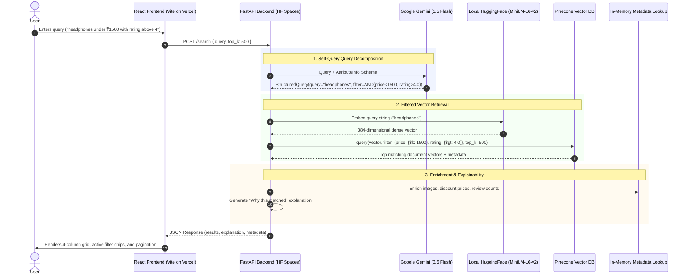

<div align="center">

# SmartFind — AI-Powered Product Search Engine

**Constraint-Aware Hybrid E-Commerce Search using LangChain SelfQueryRetriever, Google Gemini, and Pinecone Vector Database.**

<p align="center">
  
  
  
  
  
  
  
  
</p>

</div>

---

## 📑 Table of Contents

- [📌 Overview](#-overview)
- [🛑 Problem Statement: The Limits of Pure Vector Search](#-problem-statement-the-limits-of-pure-vector-search)
- [💡 Solution: Semantic Search + Structured Filtering](#-solution-semantic-search--structured-metadata-filtering)
- [✨ Key Features](#-key-features)
- [🏗️ Architecture & Search Flow](#️-architecture--search-flow)
- [🛠️ Technology Stack](#️-technology-stack)
  - [Backend](#backend)
  - [Frontend](#frontend)
- [📊 Dataset & Preprocessing](#-dataset--preprocessing)
- [📂 Project Structure](#-project-structure)
- [⚙️ Installation & Local Setup](#️-installation--local-setup)
  - [1. Backend Setup](#1-backend-setup)
  - [2. Frontend Setup](#2-frontend-setup)
- [🚀 Production Deployment (Vercel + Hugging Face)](#-production-deployment-vercel--hugging-face)
  - [Part 1: Backend Deployment on Hugging Face Spaces](#part-1-backend-deployment-on-hugging-face-spaces)
  - [Part 2: Frontend Deployment on Vercel](#part-2-frontend-deployment-on-vercel)
  - [Part 3: Automated GitHub Actions CI/CD Workflow](#part-3-automated-github-actions-cicd-workflow)
- [📡 API Documentation](#-api-documentation)
- [🧪 Example Natural-Language Queries](#-example-natural-language-queries)
- [🧠 Design Decisions & Engineering Tradeoffs](#-design-decisions--engineering-tradeoffs)
- [🔒 Security Best Practices](#-security-best-practices)
- [🔮 Future Improvements](#-future-improvements)

---

## 📌 Overview

**SmartFind** is a production-grade, constraint-aware search engine designed for modern e-commerce catalogs. Traditional e-commerce search engines rely on keyword matching (which fails on synonyms and semantic intent) or pure vector similarity search (which fails on strict numerical bounds like _"under ₹1,500"_ or _"rating above 4.2"_).

SmartFind bridges this gap using **Self-Querying Retrieval**: an LLM dynamically decomposes natural-language queries into a clean semantic search query and structured metadata filters (`price`, `rating`, `category`), executing single-pass filtered vector search over 250,000+ products in Pinecone Cloud.

---

## 🛑 Problem Statement: The Limits of Pure Vector Search

Standard Dense Vector Retrieval (RAG / Embeddings) computes cosine similarity between query embeddings and item descriptions. However, vector distance cannot reliably enforce logical constraints:

1. **Numerical Imprecision**: An embedding model does not know that `₹1,499` is strictly less than `₹1,500`, while `₹1,599` is not. A pure vector query for _"laptop under 40000"_ often returns a ₹65,000 laptop because the textual semantics are nearly identical.
2. **Hard vs. Soft Filters**: Users expect strict compliance with constraints (e.g., _"4+ star rating only"_). Pure vector search treats these as soft preferences, polluting top results with irrelevant products.
3. **Keyword Search Brittle Syntax**: Traditional SQL/NoSQL filtering requires complex UI dropdowns and facet forms, degrading mobile user experience and failing on conversational search.

---

## 💡 Solution: Semantic Search + Structured Metadata Filtering

SmartFind implements LangChain's **`SelfQueryRetriever`** paired with **Google Gemini**:

1. **Natural Language Understanding**: An LLM parses unstructured user queries (e.g., _"running shoes under 2500 with rating above 4.2"_) into an Abstract Syntax Tree (`StructuredQuery`).
2. **Query Decomposition**:
   - **Semantic Search Term**: `"running shoes"` (passed to the local embedding model).
   - **Structured Filters**: `and(price < 2500, rating > 4.2)` (translated into Pinecone metadata query syntax).
3. **Single-Pass Execution**: Pinecone evaluates the vector similarity strictly across items that satisfy the boolean metadata filter.
4. **Deterministic Match Explainability**: The backend reconstructs how each product satisfied both the semantic meaning and numerical constraints.

---

## ✨ Key Features

- **Natural-Language Constraint Extraction**: Automatically extracts price limits, rating thresholds, and product categories from conversational user queries.
- **Single-Pass Filtered Vector Retrieval**: Executes single-pass search combining dense vector similarity with boolean metadata filters in Pinecone Cloud.
- **Search Explainability ("💡 Why this matched")**: Generates clear, human-readable explanations showing the exact semantic terms and satisfied filter thresholds for every result.
- **Local Zero-Cost Embedding Pipeline**: Generates 384-dim dense vectors locally on CPU using `all-MiniLM-L6-v2` with zero API costs and rate limits.
- **Production Catalog Scale**: Efficiently handles 258,000+ indexed products with deterministic MD5 deduplication and responsive 48-item pagination.

---

## 🏗️ Architecture & Search Flow



---

## 🛠️ Technology Stack

### **Backend**

- **Framework**: FastAPI (Python 3.10+)
- **Orchestration**: LangChain (`SelfQueryRetriever`, `PineconeTranslator`)
- **LLM**: Google Gemini (`gemini-3.5-flash-lite` via `langchain-google-genai`)
- **Vector Database**: Pinecone Cloud Serverless (`cosine` metric, 384 dimensions)
- **Embedding Model**: HuggingFace `sentence-transformers/all-MiniLM-L6-v2` (Local CPU / PyTorch)
- **Deployment**: Hugging Face Spaces (Docker, 16GB RAM)
- **Data Processing**: Pandas

### **Frontend**

- **Framework**: React 18
- **Build Tool**: Vite
- **HTTP Client**: Axios
- **Deployment**: Vercel (Global Edge Network)
- **Typography**: Outfit & Inter (Google Fonts)
- **Styling**: Modern CSS Design System (Custom tokens, responsive grid, zero heavy UI frameworks)

---

## 📊 Dataset & Preprocessing

The underlying catalog is derived from large-scale Amazon e-commerce product archives containing 140 department categories.

### **Preprocessing Pipeline (`backend/src/preprocessing.py`)**

1. **Price Normalization**: Cleans currency strings, strips symbols (`₹`, `,`), and extracts numeric floats in INR (falls back from `discount_price` to `actual_price`).
2. **Rating Validation**: Converts rating strings (`0.0` to `5.0`) to numeric floats, dropping unrated/null entries.
3. **Search Content Formatting**: Concatenates `name` and `sub_category` into descriptive search texts.
4. **Deduplication**: Eliminates cross-category duplicate listings using unique product titles.
5. **Final Clean Catalog**: **258,911 distinct products** saved to `backend/data/amazon_preprocessed.csv` and `backend/data/amazon.csv` (excluded from Git tracking via `.gitignore` to avoid large file limits).

---

## 📂 Project Structure

```text
SmartFind/
├── .github/
│   └── workflows/
│       └── deploy-backend-hf.yml      # CI/CD: Auto-sync backend to Hugging Face Spaces
│
├── backend/
│   ├── data/                          # Cleaned dataset (gitignored / local)
│   │   ├── amazon.csv                 # Master metadata lookup (images, ratings, links)
│   │   └── amazon_preprocessed.csv    # Vector indexing dataset (text, price, rating, category)

│   ├── models/
│   │   └── all-MiniLM-L6-v2/          # Local HuggingFace embedding weights (384-dim)
│   ├── scripts/
│   │   └── run_batch_indexing.py      # Idempotent Pinecone vector batch uploader
│   ├── src/
│   │   ├── __init__.py
│   │   ├── app.py                     # FastAPI application & /search endpoint
│   │   ├── explainer.py               # AST explainability reasoning generator
│   │   ├── retriever.py               # SelfQueryRetriever + Gemini configuration
│   │   ├── schema.py                  # SelfQuery metadata attribute definitions
│   │   ├── document_loader.py         # DataFrame to LangChain Document converter
│   │   ├── preprocessing.py           # Data cleaning & currency normalization
│   │   └── vectorstore.py             # Pinecone VectorStore initialization & connection
│   ├── Dockerfile                     # Docker container specification for HF Spaces
│   ├── requirements.txt               # Python package dependencies
│   ├── README.md                      # Hugging Face Spaces metadata configuration
│   └── .env.example                   # Backend environment template
│
├── frontend/
│   ├── public/
│   ├── src/
│   │   ├── components/
│   │   │   ├── EmptyState.jsx         # Zero-results suggestion UI
│   │   │   ├── ErrorState.jsx         # Graceful error banner with retry
│   │   │   ├── Explanation.jsx        # "Why this matched" collapsible accordion
│   │   │   ├── FilterChips.jsx        # Active constraint chips
│   │   │   ├── Header.jsx             # Branding & AI badge
│   │   │   ├── LoadingState.jsx       # Non-freezing skeleton loaders
│   │   │   ├── Pagination.jsx         # 48 items/page numbered navigation
│   │   │   ├── ProductCard.jsx        # Product display card with image fallback
│   │   │   ├── ResultsHeader.jsx      # Query context & product counter
│   │   │   └── SearchBar.jsx          # Input, suggestions & clear button
│   │   ├── App.jsx
│   │   ├── main.jsx
│   │   ├── index.css                  # Design system tokens & 4-col responsive grid
│   │   └── ProductSearch.jsx          # Main container component
│   ├── index.html                     # HTML shell with no-referrer policy
│   ├── package.json
│   ├── vercel.json                    # Vercel deployment configuration
│   ├── .env.example                   # Frontend environment template
│   └── vite.config.js
│
├── .gitignore
└── README.md
```

---

## ⚙️ Installation & Local Setup

### **Prerequisites**

- Python 3.10+
- Node.js 18+ and npm
- Pinecone Cloud API Key
- Google Gemini API Key

---

### **1. Backend Setup**

```powershell
# Navigate to backend directory
cd backend

# Create and activate virtual environment
python -m venv venv
# Windows:
.\venv\Scripts\activate
# Linux/macOS:
# source venv/bin/activate

# Install dependencies
pip install -r requirements.txt
```

#### **Configure Environment Variables (`backend/.env`)**

Create a `.env` file in the `backend/` directory:

```env
GEMINI_API_KEY=your_google_gemini_api_key_here
PINECONE_API_KEY=your_pinecone_api_key_here
PINECONE_INDEX_NAME=ecommerce-products
```

#### **(Optional) Index the Vector Database**

To index the 258,911 preprocessed products into Pinecone:

```powershell
python scripts/run_batch_indexing.py full
```

#### **Run FastAPI Backend**

```powershell
python -m uvicorn src.app:app --host 0.0.0.0 --port 8000
```

- **API Documentation (Swagger UI)**: [http://127.0.0.1:8000/docs](http://127.0.0.1:8000/docs)
- **Health Check**: [http://127.0.0.1:8000/health](http://127.0.0.1:8000/health)

---

### **2. Frontend Setup**

```powershell
# Navigate to frontend directory
cd frontend

# Install dependencies
npm install

# Start Vite development server
npm run dev
```

- **Web Application**: [http://localhost:5173/](http://localhost:5173/)

---

## 🚀 Production Deployment (Vercel + Hugging Face)

SmartFind uses a decoupled production architecture: the **FastAPI Backend** runs on **Hugging Face Spaces** (providing 16GB RAM for PyTorch and catalog memory caching), while the **React Frontend** is deployed globally on **Vercel**.

```
┌─────────────────────────┐          HTTPS (JSON)          ┌───────────────────────────────────┐
│     Vercel Edge CDN     │ ─────────────────────────────> │       Hugging Face Spaces         │
│  React 18 + Vite (SPA)  │ <───────────────────────────── │  FastAPI + PyTorch (16GB RAM)     │
└─────────────────────────┘                                └───────────────────────────────────┘
```

---

### **Part 1: Backend Deployment on Hugging Face Spaces**

1. Go to **[Hugging Face](https://huggingface.co/)** ➔ click **New Space**.
2. Set Space Name: `smartfind-backend` (or your choice).
3. Select **Space SDK**: **Docker** (Blank).
4. In your Space's **Settings** ➔ **Variables and Secrets**, add the following **Secrets**:
   - `GEMINI_API_KEY`: Your Google Gemini API Key
   - `PINECONE_API_KEY`: Your Pinecone API Key
   - `PINECONE_INDEX_NAME`: `ecommerce-products`
5. Note your Space URL: `https://<hf-username>-smartfind-backend.hf.space` (or via **Embed this Space** ➔ Direct URL).

---

### **Part 2: Frontend Deployment on Vercel**

1. Push your repository to **GitHub**.
2. Go to **[Vercel](https://vercel.com/)** ➔ click **Add New Project** ➔ Import your repository.
3. In Project Configuration:
   - **Framework Preset**: `Vite`
   - **Root Directory**: Select `frontend`
4. Under **Environment Variables**, add:
   - `VITE_API_BASE_URL`: `https://<hf-username>-smartfind-backend.hf.space`
5. Click **Deploy**.

---

### **Part 3: Automated GitHub Actions CI/CD Workflow**

This repository includes an automated workflow (`.github/workflows/deploy-backend-hf.yml`) that automatically synchronizes code changes in `backend/` directly to your Hugging Face Space whenever you push to the `main` branch.

#### **Setup GitHub Repository Secrets:**
1. In your GitHub repository, go to **Settings** ➔ **Secrets and variables** ➔ **Actions**.
2. Add the following repository secrets:
   - `HF_TOKEN`: Your Hugging Face Access Token (with `write` permission from [huggingface.co/settings/tokens](https://huggingface.co/settings/tokens))
   - `HF_USERNAME`: Your Hugging Face username
   - `HF_SPACE_NAME`: Your Space name (e.g. `smartfind-backend`)

Every time you commit changes to `backend/`, GitHub Actions will build and deploy the update to Hugging Face Spaces with zero downtime.

---

## 📡 API Documentation

### **Endpoint: `POST /search`**

Executes conversational self-querying search with structured metadata filtering.

#### **Request Format**

```json
{
  "query": "headphones under 1500 with rating above 4",
  "top_k": 500
}
```

#### **Response Format**

```json
{
  "query": "headphones under 1500 with rating above 4",
  "count": 500,
  "results": [
    {
      "page_content": "boAt Rockerz 450 Bluetooth On Ear Headphones with Mic - Headphones",
      "metadata": {
        "price": 1499.0,
        "rating": 4.2,
        "category": "All Electronics",
        "image": "https://m.media-amazon.com/images/I/61u1VALn6JL._AC_UL320_.jpg",
        "no_of_ratings": "125,430",
        "actual_price": "₹3,990",
        "discount_price": "₹1,499"
      },
      "explanation": "Matched 'headphones' via semantic similarity • Price ₹1,499 satisfies filter (< ₹1,500) • Rating 4.2★ satisfies filter (> 4.0★)"
    }
  ]
}
```

---

## 🧪 Example Natural-Language Queries

| Query Type               | Natural Language Input                      | Extracted Semantic Term | Extracted Metadata Filter                           |
| :----------------------- | :------------------------------------------ | :---------------------- | :-------------------------------------------------- |
| **Price Constraint**     | `"headphones under ₹2000"`                  | `"headphones"`          | `price < 2000`                                      |
| **Rating Threshold**     | `"running shoes rating above 4.3"`          | `"running shoes"`       | `rating > 4.3`                                      |
| **Combined Filters**     | `"phones under 20000 with rating above 4"`  | `"phones"`              | `and(price < 20000, rating > 4.0)`                  |
| **Category Constraint**  | `"laptops under 40000 in electronics"`      | `"laptops"`             | `and(price < 40000, category == 'All Electronics')` |
| **Complex Multi-Clause** | `"split AC 1.5 ton under 35000 rating > 4"` | `"split AC 1.5 ton"`    | `and(price < 35000, rating > 4.0)`                  |

---

## 🧠 Design Decisions & Engineering Tradeoffs

1. **Self-Querying vs. Separate Filter UI**:
   - _Decision_: Extract constraints via LLM directly from the search bar instead of forcing users to configure manual sidebar facets.
   - _Tradeoff_: Requires ~1.1s LLM parsing latency, but delivers a seamless unified conversational search experience.
2. **Local Embedding Model vs. Cloud API Embeddings**:
   - _Decision_: Use local `all-MiniLM-L6-v2` via PyTorch CPU multi-threading instead of OpenAI/Cohere embedding APIs.
   - _Benefit_: Zero embedding API costs, zero rate limits, and 100% offline data indexing capability.
3. **Idempotent Deterministic Vector IDs**:
   - _Decision_: Hash `(text, category, price)` into MD5 vector IDs during Pinecone upserting.
   - _Benefit_: Re-indexing or updating datasets never inflates vector counts or creates duplicate search results.

---

## 🔒 Security Best Practices

- **API Key Isolation**: Sensitive keys (`PINECONE_API_KEY`, `GEMINI_API_KEY`) reside exclusively in backend `.env` / Space secrets and are never exposed to the client bundle.
- **CORS Whitelisting**: FastAPI backend restricts cross-origin resource sharing to trusted local and deployment origins.
- **Referrer Protection**: Frontend uses `<meta name="referrer" content="no-referrer">` to protect user privacy and prevent CDN image blocking.
- **Error Masking**: Internal tracebacks and database errors are caught and masked with friendly error states in production endpoints.

---

## 🔮 Future Improvements

- [ ] **Multi-Vector Hybrid Keyword Fusion (BM25 + Dense)**: Implement hybrid reciprocal rank fusion (RRF) combining sparse BM25 lexical scores with Pinecone dense embeddings.
- [ ] **User Personalization & Session Memory**: Integrate conversational memory to allow multi-turn query refinement (e.g., _"show me cheaper ones"_).
- [ ] **Semantic Caching**: Deploy Redis semantic vector caching to serve repeat queries in sub-50ms without invoking the LLM.
