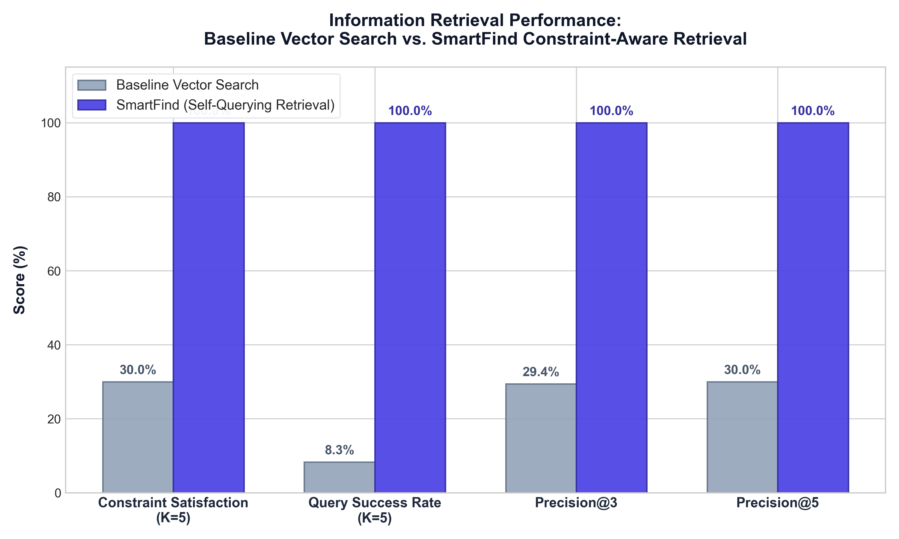

<div align="center">

# SmartFind — AI-Powered Product Search Engine

**Natural-language e-commerce search with automatic budget, rating, and category filtering.**

<p align="center">
  
  
  
  
  
  
  
</p>

</div>

---

## 📑 Table of Contents

- [📌 What is SmartFind?](#-what-is-smartfind)
- [💡 Why I Built It](#-why-i-built-it)
- [⚙️ How It Works](#️-how-it-works)
- [✨ Features](#-features)
- [🛠️ Tech Stack](#️-tech-stack)
- [📊 Dataset](#-dataset)
- [📈 Evaluation](#-evaluation)
- [📂 Project Structure](#-project-structure)
- [🚀 Getting Started](#-getting-started)
- [🔍 Example Queries](#-example-queries)
- [🎯 Why This Project?](#-why-this-project)
- [⚠️ Limitations](#️-limitations)
- [🔮 Future Improvements](#-future-improvements)

---

## 📌 What is SmartFind?

SmartFind is an e-commerce search engine that lets users search for products using plain, everyday language while automatically applying strict budget, rating, and category requirements.

When shopping online, people rarely search using just single keywords. Instead, they search with natural sentences like *"wireless headphones under ₹1,500 with rating above 4 stars"*. 

SmartFind uses an LLM to separate the user's intent into two parts: **what the product is** (semantic search) and **what rules it must follow** (price ceilings, minimum ratings, and departments). It searches over 258,000 products and only returns items that match both the concept and the exact numbers.

---

## 💡 Why I Built It

Traditional search systems and basic vector search engines struggle with natural shopping queries:

- **Keyword Search** fails when users use synonyms or conversational phrases (e.g., searching *"budget gym shoes"* might miss items titled *"athletic running sneakers"*).
- **Basic Vector Search** understands meaning, but it cannot do math. Because embeddings only measure text similarity, a vector search for *"headphones under ₹1,500"* often returns ₹14,000 studio headphones simply because the text description looks similar.

### Example:
> **Search Query:** *"Headphones under ₹1,500 with rating above 4"*
>
> - **Normal Vector Search:** Returns top-rated ₹8,000 headphones because they are high quality and match the word "headphones" (violates the ₹1,500 budget).
> - **SmartFind:** Searches for "headphones", but strictly filters the database so only items with `price <= 1500` and `rating >= 4.0` can ever be returned.

---

## ⚙️ How It Works


1. **User Query**: The user types a natural-language search into the search bar.
2. **Query Understanding**: Google Gemini parses the sentence and separates the product keywords from the numeric constraints (e.g., `price <= 1500`, `rating >= 4.0`).
3. **Filtered Vector Search**: Pinecone runs a vector search on the product meaning while applying the filters directly on the database nodes.
4. **Enrichment & Formatting**: FastAPI retrieves product images, discounts, and ratings from the local dataset.
5. **Results & Explanation**: The frontend displays product cards along with a clear explanation of why each product matched the query.

---

## ✨ Features

- **Natural-Language Search**: Search for products using conversational sentences.
- **Price and Rating Constraints**: Automatically filters items by price limits and minimum star ratings.
- **Category Filtering**: Recognizes product departments (e.g., Electronics, Footwear, Home & Kitchen).
- **Semantic Vector Search**: Finds relevant items even if the exact keyword is not in the title.
- **Explainable Results**: Each product card explains how it satisfied the search query and filters.
- **Responsive Web Interface**: Clean, mobile-friendly React frontend with suggestion chips and pagination (48 items per page).
- **Production API**: Lightweight FastAPI backend with interactive Swagger documentation (`/docs`) and health checks.

---

## 🛠️ Tech Stack

| Technology | Purpose |
| :--- | :--- |
| **React 18 & Vite** | Frontend user interface and responsive styling |
| **FastAPI & Uvicorn** | High-performance Python backend REST API |
| **LangChain** | Self-querying retrieval orchestration and AST filter translation |
| **Google Gemini** | Natural-language query parsing and constraint extraction |
| **Pinecone Cloud** | Serverless vector database for vector similarity search |
| **FastEmbed (ONNX)** | Lightweight CPU embedding engine (`all-MiniLM-L6-v2`, 384 dimensions) |
| **PyArrow & Parquet** | Fast on-disk product metadata lookups with minimal memory usage |

---

## 📊 Dataset

SmartFind is tested on a dataset of **258,911 real-world Amazon India products**:

- **Stored in Pinecone**: 384-dimensional dense vectors generated from product titles and categories, along with numerical metadata fields (`price`, `rating`, `category`).
- **Stored on Disk (`metadata.parquet`)**: Complete product catalog information including product images, discount percentages, review counts, and actual retail prices.
- **Lookups**: The backend uses PyArrow to stream metadata from disk during search requests in ~15ms without loading the entire 258k rows into RAM.

---

## 📈 Evaluation

To verify whether constraint-aware retrieval actually performs better than standard vector search, we built an automated benchmark module in `evaluation/` and tested **60 realistic shopping queries** against the entire 258,911 product catalog in Pinecone.

### Benchmark Results ($K=5$)

| Metric | Baseline Vector Search | SmartFind (Self-Query) | Difference |
| :--- | :---: | :---: | :---: |
| **Constraint Satisfaction Rate** | 30.0% | **100.0%** | **+70.0% pts** |
| **Query Success Rate** | 8.3% | **100.0%** | **+91.7% pts** |
| **Precision @ 3** | 29.4% | **100.0%** | **+70.6% pts** |
| **Precision @ 5** | 30.0% | **100.0%** | **+70.0% pts** |
| **Average Latency** | **378.7 ms** | 2,033.0 ms | +1.65s (LLM parsing) |

<div align="center">
  
</div>

### What These Numbers Mean:
- **Constraint Satisfaction (30.0% → 100.0%)**: In baseline vector search, 70% of returned items broke the user's price or rating rules. SmartFind ensures 100% of returned products respect every constraint.
- **Query Success Rate (8.3% → 100.0%)**: Only 8.3% of queries in baseline search returned a completely clean page of results. SmartFind returned 100% compliant pages across all 60 test queries.
- **Tradeoff**: SmartFind takes ~2.0 seconds per query (compared to ~0.38 seconds for basic vector search) because the LLM needs to parse the query before searching.

---

## 📂 Project Structure

```text
SmartFind/
├── backend/
│   ├── src/
│   │   ├── app.py              # FastAPI application, search endpoints, and Parquet lookup
│   │   ├── retriever.py        # SelfQueryRetriever initialization with Gemini
│   │   ├── schema.py           # Product metadata schema and field descriptions
│   │   └── vectorstore.py      # Pinecone connection and FastEmbed ONNX wrapper
│   ├── data/
│   │   └── metadata.parquet    # Compressed metadata for 258,911 products
│   ├── scripts/
│   │   ├── run_batch_indexing.py # Pinecone vector indexing script
│   │   └── preprocess_data.py  # Data cleaning and parquet compression
│   └── requirements.txt        # Backend dependencies (FastAPI, Pinecone, LangChain)
├── frontend/
│   ├── src/
│   │   ├── components/         # SearchBar, ProductCard, Pagination, Header
│   │   ├── ProductSearch.jsx   # Main search view and state management
│   │   └── index.css           # Responsive design system
│   ├── index.html              # HTML entry point with mobile viewport settings
│   └── package.json            # Frontend dependencies (React 18, Vite)
├── evaluation/
│   ├── queries.json            # 60 test queries with expected constraints
│   ├── metrics.py              # Metrics logic (Constraint Satisfaction, Precision@K)
│   ├── evaluate.py             # Benchmark runner script
│   ├── generate_chart.py       # Matplotlib comparison chart generator
│   └── results.json            # Raw benchmark data output
└── README.md                   # Project documentation
```

---

## 🚀 Getting Started

### Prerequisites
- Python 3.10+
- Node.js 18+
- A free [Pinecone](https://www.pinecone.io/) account and API key
- A free [Google AI Studio](https://aistudio.google.com/) Gemini API key

### 1. Clone the Repository
```bash
git clone https://github.com/your-username/SmartFind.git
cd SmartFind
```

### 2. Backend Setup
```bash
cd backend
python -m venv venv
# On Windows:
venv\Scripts\activate
# On Linux/macOS:
source venv/bin/activate

pip install -r requirements.txt
```

Create a `.env` file in the `backend/` folder:
```env
PINECONE_API_KEY=your_pinecone_api_key
PINECONE_INDEX_NAME=ecommerce-products
GEMINI_API_KEY=your_gemini_api_key
```

Run the backend server:
```bash
uvicorn src.app:app --host 0.0.0.0 --port 8000 --reload
```
API docs will be live at `http://localhost:8000/docs`.

### 3. Frontend Setup
Open a new terminal:
```bash
cd frontend
npm install
npm run dev
```
Open `http://localhost:5173` in your browser.

### 4. Running the Evaluation Benchmark
To run the 60-query benchmark locally:
```bash
python evaluation/evaluate.py
```

---

## 🔍 Example Queries

Try searching for queries like:

- `headphones under ₹1500 with rating above 4`
- `wireless earbuds under ₹2000`
- `laptops under ₹45000 in electronics`
- `running shoes under ₹2500 with rating above 4.2`
- `air fryer under ₹5000 with rating above 4`

---

## 🎯 Why This Project?

Most AI search tutorials stop at basic vector similarity. In real-world e-commerce, pure semantic search is not enough because users have hard constraints like budgets and minimum review scores. 

SmartFind demonstrates how to combine **natural-language understanding** with **structured database filtering** to create search results that are both semantically relevant and mathematically accurate.

---

## ⚠️ Limitations

- **Latency**: Query parsing with an LLM adds ~1.5 seconds of overhead compared to basic keyword search.
- **Static Dataset**: The current demonstration uses a static snapshot of Amazon products rather than a live inventory stream.
- **Model Availability**: The free tier of Gemini has per-minute request limits during continuous batch evaluation.

---

## 🔮 Future Improvements

- [ ] **Semantic Caching**: Cache common query decompositions in Redis to reduce search latency to under 100ms.
- [ ] **Hybrid Search**: Combine lexical BM25 keyword matching with dense vectors for brand code searches (e.g., exact model numbers).
- [ ] **Conversational Refinement**: Allow users to refine results across multiple chat turns (e.g., *"show me cheaper ones"*).

---
