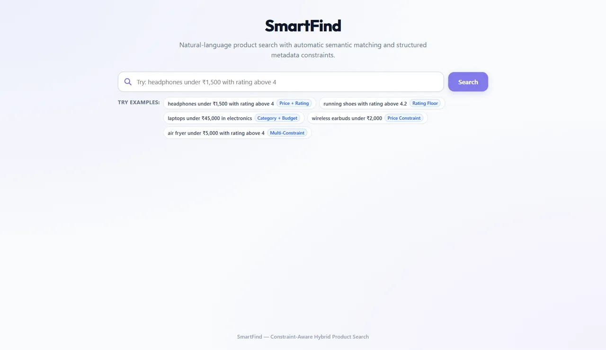
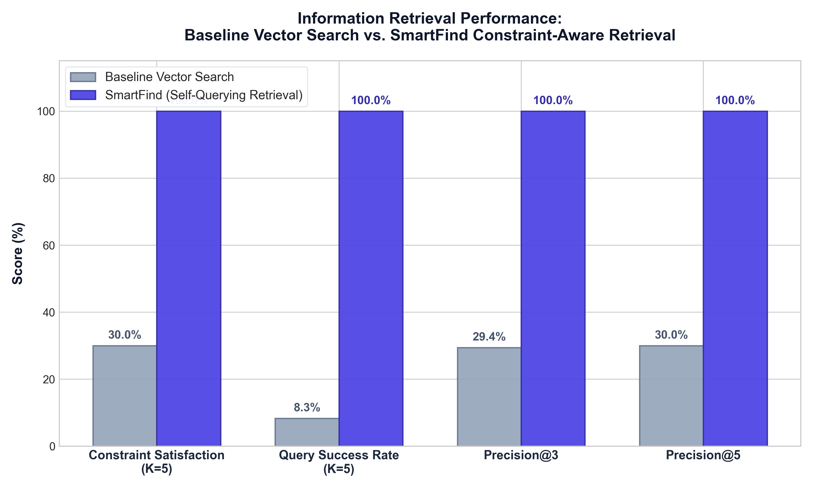
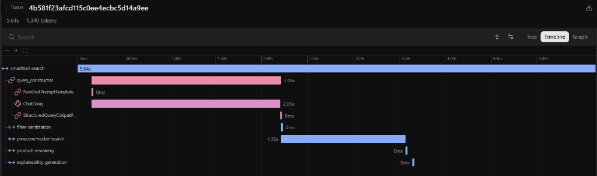

<div align="center">

# SmartFind: AI-Powered Product Search Engine

[](https://react.dev/)
[](https://fastapi.tiangolo.com/)
[](https://www.langchain.com/)
[](https://groq.com/)
[](https://www.pinecone.io/)
[](https://www.mongodb.com/atlas)
[](https://langfuse.com/)

_Natural-language e-commerce search with automatic budget, rating, category filtering, persistent MongoDB cart, and Groq AI cart summarization._

<br />



<br />

</div>

---

## 📖 Table of Contents

- [What is SmartFind?](#-what-is-smartfind)
- [Why I Built It](#-why-i-built-it)
- [How It Works](#-how-it-works)
- [Features](#-features)
- [Tech Stack](#-tech-stack)
- [User Auth & Cloud Cart (MongoDB & Groq)](#-user-auth--cloud-cart-mongodb--groq)
- [Dataset](#-dataset)
- [Evaluation](#-evaluation)
- [LLM Observability & Tracing](#-llm-observability--tracing)
- [Project Structure](#-project-structure)
- [Getting Started](#-getting-started)
- [Example Queries](#-example-queries)
- [Why This Project?](#-why-this-project)
- [Limitations](#-limitations)
- [Future Improvements](#-future-improvements)

---

## 🔍 What is SmartFind?

SmartFind is an e-commerce search engine that lets users search for products using plain, everyday language while automatically applying strict budget, rating, and category requirements.

When shopping online, people rarely search using just single keywords. Instead, they search with natural sentences like _"wireless headphones under ₹1,500 with rating above 4 stars"_.

SmartFind uses an LLM to separate the user's intent into two parts: **what the product is** (semantic search) and **what rules it must follow** (price ceilings, minimum ratings, and departments). It searches over 258,000 products and only returns items that match both the concept and the exact numbers.

---

## 💡 Why I Built It

Traditional search systems and basic vector search engines struggle with natural shopping queries:

- **Keyword Search** fails when users use synonyms or conversational phrases (e.g., searching _"budget gym shoes"_ might miss items titled _"athletic running sneakers"_).
- **Basic Vector Search** understands meaning, but it cannot do math. Because embeddings only measure text similarity, a vector search for _"headphones under ₹1,500"_ often returns ₹14,000 studio headphones simply because the text description looks similar.

### Example:

> **Search Query:** _"Headphones under ₹1,500 with rating above 4"_
>
> - **Normal Vector Search:** Returns top-rated ₹18,000 headphones because they are high quality and match the word "headphones" (violates the ₹1,500 budget).
> - **SmartFind:** Searches for "headphones", but strictly filters the database so only items with `price <= 1500` and `rating >= 4.0` can ever be returned.

---

## ⚙️ How It Works

```text
[User Query]
    │
    ▼
[Groq Cloud: openai/gpt-oss-120b] ──► Extracts: Query + {price <= 1500, rating >= 4.0}
    │
    ▼
[Pinecone Vector DB] ──► Filtered Vector Search over 258k vectors
    │
    ▼
[FastAPI Backend] ──► Product-Anchor Reranking & PyArrow Parquet Metadata
    │
    ▼
[React Frontend] ──► Product Cards + Match Explanations + Add-to-Cart
```

1. **User Input**: A user types a query like _"mechanical keyboard under 3000 with 4.2 rating"_.
2. **Query Understanding**: Groq Cloud (`openai/gpt-oss-120b`) parses the sentence in ~150ms and separates product keywords from numeric constraints (e.g., `price <= 3000`, `rating >= 4.2`).
3. **Filtered Vector Search**: Pinecone executes a vector similarity search while applying the boolean filters directly on the index nodes.
4. **Metadata Enrichment & Reranking**: FastAPI retrieves high-res images, discounts, and ratings from the local Parquet dataset, applying product-anchor reranking.
5. **Results & Cart Action**: The React frontend displays results with explainability breakdowns, allowing authenticated users to add items directly to their cloud cart.

---

## ✨ Features

- **Natural-Language Search**: Search for products using conversational sentences.
- **Price and Rating Constraints**: Automatically filters items by price limits and minimum star ratings.
- **Category Filtering**: Recognizes product departments (e.g., Electronics, Footwear, Home & Kitchen).
- **Semantic Vector Search**: Finds relevant items even if the exact keyword is not in the title.
- **Explainable Results**: Each product card explains how it satisfied the search query and filters.
- **User Authentication & Guest Sessions**: Secure user registration, login, and session persistence via bcrypt password hashing and signed JWT tokens. Also supports instant **Guest Login** allowing visitors to freely explore and add items to a temporary session cart.
- **Session-Only Guest Cart**: Guest cart items are isolated to the active browser session (`sessionStorage`) and automatically cleared upon tab closure, with instant upgrade to a persistent MongoDB cloud cart upon registration.
- **Cloud Shopping Cart (MongoDB Atlas)**: Persistent per-user shopping carts with real-time quantity adjustments, subtotal, and total price tracking.
- **Groq AI Cart Summary**: Real-time natural language cart analysis powered by Groq LLM (`qwen/qwen3.8-27b`) that breaks down categories, highlights priciest items, identifies product synergies, and computes total costs.
- **Responsive Web Interface**: Clean, mobile-friendly React frontend with suggestion chips, cart drawer/page, and pagination (48 items per page).
- **Production API**: Lightweight FastAPI backend with interactive Swagger documentation (`/docs`) and health checks.
- **Production LLM Observability & Tracing**: Distributed execution tracing via Langfuse v4 capturing end-to-end latencies, token consumption, and cost tracking across every query.

---

## 🛠️ Tech Stack

| Technology | Purpose |
| :--- | :--- |
| **React 18 & Vite** | Modern frontend user interface, responsive styling, and fast build tooling |
| **FastAPI & Uvicorn** | High-performance asynchronous Python REST API server |
| **MongoDB Atlas & Motor** | Cloud document database and async Python driver for persistent user auth and shopping carts |
| **JWT & Bcrypt** | Secure password hashing (`bcrypt`) and stateless authentication tokens (`python-jose`) |
| **LangChain** | Self-querying retrieval orchestration and AST filter translation |
| **Groq Cloud** | High-speed LLM inference for query parsing (`openai/gpt-oss-120b`) and cart summaries (`qwen/qwen3.8-27b`) |
| **Pinecone Cloud** | Serverless vector database for vector similarity search over 258k products |
| **FastEmbed (ONNX)** | Lightweight CPU embedding engine (`all-MiniLM-L6-v2`, 384 dimensions) |
| **PyArrow & Parquet** | Fast on-disk product metadata lookups with zero RAM overhead |
| **Langfuse (v4)** | Distributed LLM observability, execution tracing, latency profiling & cost tracking |

---

## 🛒 User Auth & Cloud Cart (MongoDB & Groq)

SmartFind provides full e-commerce shopping cart persistence and AI intelligence:

```text
[User Browser]
      │
      ├──► POST /auth/register ──► MongoDB `users` collection (bcrypt hash)
      ├──► POST /auth/login    ──► Issues JWT Access Token
      │
      ├──► POST /cart/add      ──► Updates MongoDB `carts` collection (per user)
      │
      └──► GET /cart/summary   ──► Groq Cloud LLM generates intelligent cart overview:
                                  • Shopping intent summary
                                  • Key & highest-priced item callouts
                                  • Product synergy analysis
                                  • Exact grand total price calculation
```

### Authentication & Cart API Endpoints

| Method | Endpoint | Description | Protected |
| :--- | :--- | :--- | :---: |
| `POST` | `/auth/register` | Register a new user account with email, username & password | No |
| `POST` | `/auth/login` | Authenticate user credentials and receive signed JWT token | No |
| `GET` | `/auth/me` | Fetch authenticated user profile details | Yes (Bearer) |
| `GET` | `/cart` | Retrieve the current user's cart, items, item count & total price | Yes (Bearer) |
| `POST` | `/cart/add` | Add a product to the user's cart (or increment quantity) | Yes (Bearer) |
| `PATCH` | `/cart/{product_id}`| Update quantity of a specific item in the cart | Yes (Bearer) |
| `DELETE`| `/cart/{product_id}`| Remove an item from the cart | Yes (Bearer) |
| `DELETE`| `/cart` | Clear all items from the cart | Yes (Bearer) |
| `GET` | `/cart/summary` | Generate real-time Groq AI summary and category cost breakdown (Registered) | Yes (Bearer) |
| `POST` | `/cart/guest-summary` | Generate real-time Groq AI summary and category cost breakdown (Guest Sessions) | No |

---

## 📊 Dataset

SmartFind is tested on a dataset of **258,911 real-world Amazon India products**:

- **Stored in Pinecone**: 384-dimensional dense vectors generated from product titles and categories, along with numerical metadata fields (`price`, `rating`, `category`).
- **Stored on Disk (`metadata.parquet`)**: Complete product catalog information including product images, discount percentages, review counts, and actual retail prices.
- **Lookups**: The backend uses PyArrow to stream metadata from disk during search requests in ~15ms without loading the entire 258k rows into RAM.

---

## 📈 Evaluation

To verify whether constraint-aware retrieval actually performs better than standard vector search, we built an automated benchmark module in `evaluation/` and tested **60 realistic shopping queries** against the entire 258,911 product catalog in Pinecone.

### Benchmark Results ($K=5$)

| Metric | Baseline Vector Search | SmartFind (Self-Query) | Difference |
| :--- | :---: | :---: | :---: |
| **Constraint Satisfaction Rate** | 30.0% | **100.0%** | **+70.0% pts** |
| **Query Success Rate** | 8.3% | **100.0%** | **+91.7% pts** |
| **Precision @ 3** | 29.4% | **100.0%** | **+70.6% pts** |
| **Precision @ 5** | 30.0% | **100.0%** | **+70.0% pts** |
| **Average Latency** | **378.7 ms** | 2,033.0 ms | +1.65s (LLM parsing) |

<div align="center">
  
</div>

### What These Numbers Mean:

- **Constraint Satisfaction (30.0% → 100.0%)**: In baseline vector search, 70% of returned items broke the user's price or rating rules. SmartFind ensures 100% of returned products respect every constraint.
- **Query Success Rate (8.3% → 100.0%)**: Only 8.3% of queries in baseline search returned a completely clean page of results. SmartFind returned 100% compliant pages across all 60 test queries.

---

## 🔭 LLM Observability & Tracing

In multi-stage retrieval pipelines, performance bottlenecks and unexpected results can occur at any step. SmartFind natively integrates **Langfuse v4 (OpenTelemetry-based)** for distributed tracing across the entire search lifecycle.

<div align="center">
  
  <p><em>Real-time Langfuse execution trace showing end-to-end latency waterfall, token counts, and span breakdown across the search pipeline.</em></p>
</div>

### Execution Breakdown & Trace Hierarchy

Every search request emits an end-to-end trace with nested execution spans:

- **`search_request`**: Root span tracking the user query, client latency, and final response status.
- **`self_query_retriever`**: LangChain callback tracking prompt token counts, completion tokens, latency, and model parameters on Groq.
- **`filter_sanitization`**: Records raw AST filter translation, key mapping, and sanitized Pinecone boolean syntax.
- **`metadata_enrichment`**: Measures PyArrow parquet disk scan latency and lookup hit rates.
- **`product_reranking`**: Logs pre- and post-rerank candidate scores, hardware boost bonuses, and accessory penalties.

---

## 📂 Project Structure

```text
SmartFind/
├── backend/
│   ├── src/
│   │   ├── database.py             # MongoDB Atlas async connection manager & index initialization
│   │   ├── retriever.py            # SelfQueryRetriever initialization with Groq (openai/gpt-oss-120b)
│   │   ├── schema.py               # LangChain AttributeInfo metadata schema definitions
│   │   ├── vectorstore.py          # Pinecone connection and FastEmbed ONNX embedding wrapper
│   │   ├── app.py                  # FastAPI application entrypoint, lifespan & CORS
│   │   ├── routes/
│   │   │   ├── __init__.py         # Route exports (auth_router, cart_router)
│   │   │   ├── auth.py             # User registration, login, and /auth/me endpoints
│   │   │   └── cart.py             # Shopping cart CRUD & Groq AI cart summarization endpoint
│   │   ├── schemas/
│   │   │   ├── __init__.py         # Pydantic schemas export
│   │   │   ├── schemas.py          # SearchRequest, DocumentResult, SearchResponse
│   │   │   ├── auth.py             # UserRegister, UserLogin, Token, UserResponse
│   │   │   └── cart.py             # CartItem, CartResponse, CartSummaryResponse
│   │   └── services/
│   │       ├── __init__.py
│   │       ├── auth.py             # Bcrypt hashing, JWT generation/validation, get_current_user dependency
│   │       ├── tracing.py          # Langfuse v4 client, @observe_search decorator & span helpers
│   │       ├── reranker.py         # Product-Anchor Re-ranking engine
│   │       ├── filters.py          # AST constraint formatter & filter sanitizer
│   │       ├── explainer.py        # Structured explainability reasoning generation
│   │       └── metadata.py         # 0-RAM PyArrow Parquet disk scanner & metadata enrichment
│   ├── data/
│   │   └── metadata.parquet        # Compressed metadata for 258,911 products
│   ├── scripts/
│   │   └── run_batch_indexing.py   # Pinecone vector indexing script
│   ├── requirements.txt            # Backend dependencies
│   └── .env.example                # Environment variables template
├── frontend/
│   ├── src/
│   │   ├── components/
│   │   │   ├── Header.jsx          # Top navigation with auth status & Cart button
│   │   │   ├── CartIcon.jsx        # Cart badge with real-time item counter
│   │   │   ├── SearchBar.jsx       # Input bar with categorized example query chips
│   │   │   ├── QueryUnderstandingPanel.jsx # Extracted semantic intent & 4-step pipeline
│   │   │   ├── ResultsHeader.jsx   # Results count, active query context & client search latency
│   │   │   ├── ProductCard.jsx     # Product card with "Add to Cart" and match explanations
│   │   │   ├── Explanation.jsx     # Structured match reasoning breakdown tags
│   │   │   ├── Pagination.jsx      # Responsive pagination controls (48 items/page)
│   │   │   ├── LoadingState.jsx    # Skeleton loading placeholders
│   │   │   ├── EmptyState.jsx      # Zero results state with clickable suggestions
│   │   │   ├── ErrorState.jsx      # Error handling banner with retry action
│   │   │   └── Footer.jsx          # Footer component
│   │   ├── contexts/
│   │   │   ├── AuthContext.jsx     # Global authentication provider (login, register, logout, JWT)
│   │   │   └── CartContext.jsx     # Global cart provider (items, live totals, sync with MongoDB)
│   │   ├── pages/
│   │   │   ├── AuthPage.jsx        # Login & Registration tabbed portal
│   │   │   └── CartPage.jsx        # Shopping cart view with Groq AI summary generator
│   │   ├── ProductSearch.jsx       # Main search controller & state
│   │   ├── App.jsx                 # React Router routing setup
│   │   ├── index.css               # Global styling & layout
│   │   └── main.jsx                # React app bootstrapping
│   ├── package.json                # Frontend dependencies (React 18, Vite, React Router)
│   └── vite.config.js              # Vite configuration
├── evaluation/
│   ├── queries.json                # 60 test queries with expected constraints
│   ├── metrics.py                  # Evaluation metrics (Constraint Satisfaction, Precision@K)
│   ├── evaluate.py                 # Automated benchmark runner comparing hybrid vs standard search
│   ├── generate_chart.py           # Benchmark comparison visualization generator
│   ├── benchmark_comparison.png    # Generated evaluation metrics chart
│   └── results.json                # Raw benchmark data output
├── render.yaml                     # Render cloud deployment blueprint (Backend + Static Frontend)
├── .gitignore                      # Git ignore rules
└── README.md                       # Comprehensive project documentation
```

---

## 🚀 Getting Started

### Prerequisites

- Python 3.10+
- Node.js 18+
- A free [Pinecone](https://www.pinecone.io/) account and API key
- A free [Groq Cloud](https://console.groq.com/) API key
- A free [MongoDB Atlas](https://www.mongodb.com/atlas) cluster connection string

### 1. Clone the Repository

```bash
git clone https://github.com/your-username/SmartFind.git
cd SmartFind
```

### 2. Backend Setup

```bash
cd backend
python -m venv venv

# On Windows:
venv\Scripts\activate
# On Linux/macOS:
source venv/bin/activate

pip install -r requirements.txt
```

Create a `.env` file in the `backend/` directory:

```env
# AI & Vector Database
GROQ_API_KEY=your_groq_api_key
PINECONE_API_KEY=your_pinecone_api_key
PINECONE_INDEX_NAME=ecommerce-products

# MongoDB Atlas (User Auth & Shopping Cart)
MONGODB_URI=mongodb+srv://<username>:<password>@cluster0.xxxxx.mongodb.net/smartfind?retryWrites=true&w=majority
MONGODB_DB_NAME=smartfind

# JWT Security
JWT_SECRET_KEY=your_super_secret_random_jwt_key
JWT_ALGORITHM=HS256
JWT_EXPIRY_MINUTES=1440

# Groq Cart Summarization Model (Optional)
GROQ_CART_MODEL=qwen/qwen3.8-27b

# Optional: LLM Observability & Tracing (https://cloud.langfuse.com)
LANGFUSE_PUBLIC_KEY=pk-lf-...
LANGFUSE_SECRET_KEY=sk-lf-...
LANGFUSE_BASE_URL=https://cloud.langfuse.com
```

Run the backend server:

```bash
uvicorn src.app:app --host 0.0.0.0 --port 8000 --reload
```

Interactive API documentation will be live at `http://localhost:8000/docs`.

### 3. Frontend Setup

Open a new terminal window:

```bash
cd frontend
npm install
npm run dev
```

Open `http://localhost:5173` in your browser.

### 4. Running the Evaluation Benchmark

To run the 60-query benchmark locally:

```bash
python evaluation/evaluate.py
```

---

## 💬 Example Queries

Here are realistic queries you can run in SmartFind:

- `wireless bluetooth headphones under 1500 with rating above 4`
- `running shoes for men under 2500`
- `mechanical gaming keyboard under 3000 rating 4.2`
- `stainless steel water bottle under 800`
- `laptop backpacks under 2000 with 4 star rating`

---

## 🎯 Why This Project?

Most e-commerce websites still use rigid faceted filter menus or simple keyword search bars. When modern consumers use conversational AI (ChatGPT, Perplexity, Gemini), they expect e-commerce sites to understand natural language requirements like *"durable gym bag under 1200 with good reviews"*.

SmartFind demonstrates how combining **semantic vector search** with **LLM structured query extraction**, **cloud NoSQL persistence**, and **fast generative AI summarization** delivers a truly modern, intelligent shopping experience.

---

## ⚠️ Limitations

- **Catalog Coverage**: Tested against Amazon India data (~258,000 products); domain-specific queries outside this catalog will return fewer items.
- **Latency Overhead**: LLM self-querying adds ~150–300ms compared to raw vector similarity search.
- **Dynamic Pricing**: Prices in metadata reflect indexed snapshot values; live e-commerce integrations would sync real-time price updates via webhooks.

---

## 🔮 Future Improvements

- [ ] **Multi-turn Shopping Assistant**: Conversational filter refinement (e.g., *"Show me only the blue ones"*).
- [ ] **Stripe Checkout Integration**: Seamless payment processing directly from the MongoDB cart.
- [ ] **Personalized Recommendations**: User-specific product affinities based on cart history.
- [ ] **Hybrid BM25 + Dense Search**: Reciprocal Rank Fusion (RRF) combining sparse keyword matching with dense vectors.
